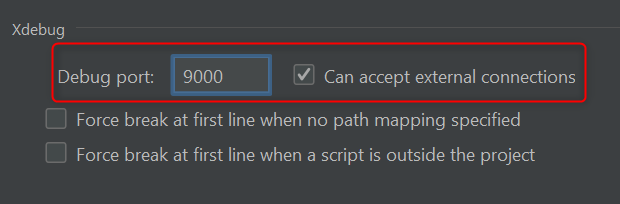
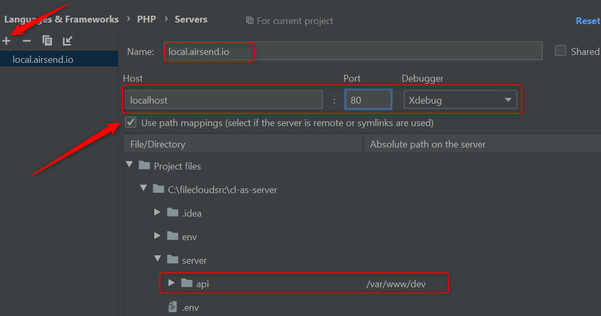
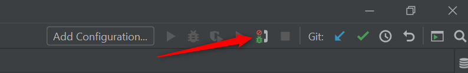
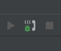

AirSend - Dev environment
=================

This repository holds the tooling to set up a local environment to allow development on Airsend. 
Inside this file you'll find useful information about how to build and bring the env up.

All the steps described here can be run using the automated script `build` available on the 
root of this repo.

If you see any problem setting up your environment, please open a ticket. We'll be glad to help.

### First steps

First, please clone this repository on your local environment.

There is a single directory inside this folder that holds the required files for the environment build (like 
dockerfiles, config files, etc.), and also some git settings, build scripts and the root docker-compose file.

Then ensure all the requirements are set up (check the "Requirements" section bellow).

#### Requirements:

This environment was tested using the versions described bellow. It may work on newer (or even older) versions.
* Bash v3.2.57 (only if you use the automated scripts)
* Git v2.37.1
* Docker v20.10.17

### Simplified Setup

If you choose to run the environment using the automated scripts, just run:
`./build`

The above script should be run only once. It will build the environment. Wait fot the build to run, and after that run:
`docker compose up -d`

At this point the environment should be working. Please check the logs to troubleshoot any problem, and if something 
is not working, check the other sections of this document before opening an issue.

The default config should work on most of the environments, but depending on your local machine, you may need to 
override some configs (like ports that may be already in use inside your system e.g).

If you want to bring the environment down, just run:
`docker compose down`

### Step-by-step setup

If you're using Windows, don't have access to bash, or you have any other reason to don't use the automated script,
you can follow the steps below. It may also help troubleshooting if you have problems on the env build.

The requirements are the same. The only difference is that here we describe each step.

1. Check if any of the TCP ports used by default by the Airsend dev environment is already being used by your system.
If a port is already in use, create a .env file next to this `readme.md` overriding the port with the proper env 
variable.

Here are the ports used by the env:

| Variable                 | Default value | Description                                                                                            |
|--------------------------|---------------|--------------------------------------------------------------------------------------------------------|
| AIRSEND_API_EXPOSED_PORT | 20000         | HTTP port where the development application (realtime code changes) runs on.                           |
| AIRSEND_WEBSOCKET_PORT   | 20001         | Websocket port exposed to the host machine, for clients to connect on                                  |
| AIRSEND_DB_EXPOSED_PORT  | 20002         | MySQL exposed port (for MySQL clients connections from the host machine)                               | 
| AIRSEND_REDIS_PORT       | 20003         | Redis exposed port (for Redis clients connections from the host machine)                               |
| AIRSEND_XDEBUG_PORT      | 20004         | XDebug connection port (for Xdebug connections to the IDE on host machine. See Debugging section below) |
| AIRSEND_ZOOKEEPER_PORT   | 20005         | Zookeeper exposed port (for connections from the host machine)                                         |
| AIRSEND_KAFKA_PORT       | 20006         | Kafka exposed port (for connections from the host machine)                                             | 
| AIRSEND_SWAGGER_PORT     | 20007         | Swagger exposed port (for connections from the host machine)                                           | 
| AIRSEND_UI_PORT          | 20008         | Web UI port                                                                                            | 


Also, you'll need to clone the code repositories of each service (you're not required to clone all the repositories, 
just the ones that you need. It's up to you). Please clone the service repositories on directories under your env root,
like the list (each directory is linked to the repository that it must be cloned):
* [./api](https://github.com/airsend-io/api)
* [./ui](https://github.com/airsend-io/ui)
* [./nodeutil](https://github.com/airsend-io/nodeutil)
* [./websocket](https://github.com/airsend-io/websocket)

Each repository has its own readme file with additional information about the service.

There are additional services that can be installed, but they're optional to the basic config:

* [./webrtc](https://github.com/airsend-io/webrtc)
* [./kafka](https://github.com/airsend-io/kafka)

Once the repositories are cloned, you can run a `docker compose build`, and then a `docker compose up -d` to bring the
environment up.

### Useful commands

* List active containers:
```
docker-compose ps
```

* Run a command (or a batch of commands) on a container:
```
docker-compose exec <container> <command>
```

* Access a container shell (always as root):
```
docker-compose exec <container> bash
```

* Rebuild the containers (when pushed changes on the environment settings):
```
docker-compose build
```

* End of the day? Tired? Please turn the env off before taking your deserved rest:
```
docker-compose down
```

* Good morning! Starting the day? Here is the command to put the env up, and also to restart the env when there is any 
change on the `docker-compose.yml` file or on the `.env` file:
```
docker-compose up -d
```

* To force the restart of all containers (when you didn't changed anything on `docker-compose.yml` or `.env`):
```
docker-compose restart
```

* To force the restart of an specific container (when you didn't changed anything on `docker-compose.yml` or `.env`):
```
docker-compose restart <container>
```

* Need a full rebuild, and a restart? All at the same time?
```
docker-compose up -d --build
```

* Want to restart just one container?
```
docker-compose up -d <container>
```

* Something is not going good? Need some logging?
```
docker-compose logs
```

* Want to keep traking of the logs? Just include the follow flag:
```
docker-compose logs -f
```

* You can also have logs from each container separated:
```
docker-compose logs -f <container>
```
#### Available containers

##### - web

This container is the web server. It's a nginx container that just serves the http requests and send the execution to 
the `api` container. It's accessed on port 80 inside the docker network. It also exposes a port on the host machine (80
by default), that can be set using an environment variable. This port is used to access the API from the host machine.
This container maps the source code from host machine, so changes made on host machine are automatically reflected 
inside the container.

##### - api

This container is the application server for the rest API. It's a php-fpm container,
that processes the requests sent to the `web` container. It's accessed on port 9000 inside the docker network. Also
is able to send connections to host port 9000 for debugging purposes (XDebug). The XDebug port can be changed using an
environment variable.
This container maps the source code from host machine, so changes made on host machine are automatically reflected 
inside the container.

##### - websocket

This container is the websocket server, for realtime communication. WebSocked clients can connect to the port defined on 
WEBSOCKET_PORT (defaults to 9001).
This container maps the source code from host machine, so changes made on host machine are automatically reflected 
inside the container.

##### - db

This container is the application database. It's a MySql container, that receives connections from the api on port 3306.
It also exposes a port on the host machine (3306 by default), that can be used to connect from database clients (like
MySql Workbench i.e.). That can be set using an environment variable. The database server have a database named `airsend`
that can be accessed by the user `airsend`, password `airsend`. If root access is necessary, it's possible to use the
user `root` with the password `airsend`.

##### - redis

Redis server, used for caching purposes. Other containers can connect to it through port 6379. It also exposes a port on
the host machine (6379 by default), that can be used to connect redis clients from the host machine. That can be 
set using an environment variable.

##### - kafka and zookeeper

Kafka service, and it's dependency (zookeeper service). Other containers can connect to it through port 9092 for Kafka,
and 2181 for Zookeeper. They also exposes their ports on the host machine (by default: 9092 for Kafka and 2181 for 
Zookeeper), that can be used to connect Kafka clients from the host machine. Those ports can be set using an environment 
variable.


#### Hint

If your system supports command alias, is pretty useful to create an alias for docker compose:
```
alias dc='docker-compose'
```

Or on Power Shell:
```
Set-Alias -Name dc -Value docker-compose 
```

Put it on your shell profile, and happy coding!

#### Setting up debugging (PhpStorm)

To setup debugging, and to be able to put breakpoints on your PhpStorm IDE, follow the instructions below.

\* This setup is aimed for PhpStorm, but it's not hard to translate it for another IDEs.

First of all, you need to configure debugging on your IDE. Go to `Settings > Languages & Frameworks > PHP > Debug` on 
the Xdebug section. Set the "Debug port" to the same value that you have on your `XDEBUG_PORT` env variable (defaults 
to 9000), and check the "Can accept external connections" option. Like this:



It makes PhpStorm accept connections from Xdebug on port 9000 when the debugging is active.

You also have to tell PhpStorm how to translate the paths on the container (paths that Xdebug will send), to local 
files (on your local machine). To do that, go to `Settings > Languages & Frameworks > PHP > Servers`, and add a new 
server with the mappings:
* Click on the `+` sign to add a new server.
* Set the name to "local.airsend.io".
* Set the host to "localhost".
* Set the port to the same port that is configured on "APP_PORT" (defaults to 80).
* Set the debugger to "Xdebug".
* Check the "Use path mappings" option.
* From the root of this repo, go to `/server/api`, and map it to `/var/www/dev`.

Like this:


On the next step, all you have to do is enable the debugging on PhpStorm, and start putting breakpoints around.

Click on this icon (Start listening to PHP Debug connections), on the right-top corner of PhpStorm:



That icon will become like this:



Now PhpStorm is all set, and ready to receive Xdebug connections.

To active xdebug on the server side (container), you need to send a special cookie on every request: "XDEBUG_SESSION".

The value of this cookie can be any value, but we recommend you to set it to "PHPSTORM".

For Chrome browser users, is recommended to install the "Xdebug Helper" extension, that automatically includes the 
cookie on every request when enabled.

Other browsers probably have similar extensions.

For Postman, you can set the cookie manually, and keep it on your workspace.

Another option is to pass the "XDEBUG_SESSION" variable on the query string. You can also use the 
"XDEBUG_SESSION_START" on the request query string. It will enable the debug for this request, and also set the cookie
for future requests. It works on the browser and on Postman.

Once you're all set, place a breakpoint on one of the first lines of `/server/api/public/index.php`, turn the debugging
on, and execute any request with the XDEBUG_SESSION flag. The execution wil stop on the breakpoint and let you debug 
the execution. If it works,  you're all set!

### Setting up Firebase messaging

To allow the application to send push notifications using Firebase Cloud Messaging (FCM), on local envs, you need to
 create a Firebase project, going to https://console.firebase.google.com. You have to be logged to a valid Google
  account (you can use your Codelathe email for that).
  
Once you have your project created, go to project console (clicking on it), click on the gear icon (settings), and
 then on "Project Settings". Go to the "Service Accounts" tab, and generate a new private key file (it will download
  a json file). Paste this file to `server/nodeutils/config/firebasepk.json` (rename the file). You should be good.
  
ATTENTION! NEVER CHECKOUT THIS FILE TO VCS/GIT.

The file is git-ignored, and should never be checked out to the VCS, because it holds confidential data.

ATTENTION 2! UPDATE YOUR CLIENTS!

If you're using your local to send push notifications to client devices, those devices must register to the same
 Firebase project, using FCM credentials from this project.


  


